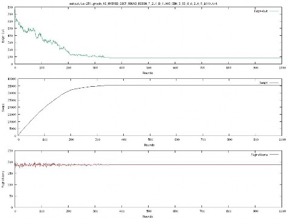

# K-way Graph Partitioning Using JaBeJa

The goal of this assignment is to understand distributed graph partitioning using gossip-based peer-to-peer techniques, such as, JaBeJa described in [F. Rahimian, et al., JA-BE-JA: A Distributed Algorithm for Balanced Graph Partitioning, SASO2013](https://kth.instructure.com/courses/6420/files/1343721/download?verifier=SRj8uA2ClilCgXvGDriqXm70zR4RskRjOkdhoWcQ&wrap=1) Extended version: [F Rahimian et al., [A distributed algorithm for large-scale graph partitioning](http://publicatio.bibl.u-szeged.hu/5295/1/taas15.pdf)., ACM Transactions on Autonomous and Adaptive Systems (TAAS) 10 (2), 12]

This assignment consists of the following two tasks.

## Task 1

In the first task, you are to implement the Ja-Be-Ja algorithm. We provide a scaffolding source code for Ja-Be-Ja simulation for one-host-one-node model. The source code is available on [github](https://github.com/smkniazi/id2222)Links to an external site.. The simulator is written in Java. To compile the results you need [gnuplot](http://gnuplot.sourceforge.net/)Links to an external site., a portable command-line driven graphing utility.

You can run the program using the run.sh ​script. Run `./run.sh` -help to see all the possible command line parameters. All the sample graphs are stored in the `./graphs` directory; use the 3elt, add20, and Facebook/Twitter graphs in your experiments. After running the experiment, the results are stored in the `./output` ​directory. Use the `plot.sh` ​to visualize the results. `plot.sh​` generates a graph.png file in the current directory.

```
./compile.sh
./run -graph ./graphs/3elt.graph
./plot .sh output/result
```



In order to implement Ja-Be-Ja, you need to modify the `JaBeJa.java` class. All the methods that you need to implement are marked using the with `TODO` tags. You have to implement the `sampleAndSwap(...)` ​method and the `findPartner(...)` method as described in the paper. This should be an easy task as all the supporting code is already implemented.

## Task 2

In the second task you will tweak different JaBeJa configurations in order to find the smallest edge cuts for the given graphs.

In this task, you are to analyze how the performance of the algorithm is affected when different parameters are changed, specially the effect of simulated annealing. Currently, Ja-Be-Ja uses a linear function to decrease the temperature (lines 9 - 13 of the Ja-Be-Ja algorithm) and the temperature is multiplied to the cost function (line 26 of the Ja-Be-Ja algorithm). You will now analyze how changing the simulated annealing parameters and the acceptance probability function affects the performance of Ja-Be-Ja.

1. First you will implement a different simulated mechanism described [here](http://katrinaeg.com/simulated-annealing.html). Links to an external site.. Observe how this change affects the rate of convergence. You can tweak different parameters. Remember that when using this method, the maximum initial temperature is 1.

2. You should notice that once the parameter `T`reaches its final value (that is, no more bad swaps are allowed) then Ja-Be-Ja converges to an edge cut rapidly and the edge cut does not change over time. You will investigate how the Ja-Be-Ja algorithm behaves when the simulated annealing is restarted after Ja-Be-Ja has converged. For example if `T`is 2 and `delta` is 0.01 then after 200 rounds the temperature will cool down to 1 and no more bad-swaps will be accepted. Ja-Be-Ja will converge soon after that. You can restart simulated-annealing again after 400 rounds. Experiment with different parameters and configurations to find lower edge cuts.

## Sample graphs

All the sample graphs are stored in the `./graphs directory`. Analyse the `3elt, add20,` and `Facebook/Twitter graphs` in your experiments for both tasks.

## Optional task for extra bonus

Define your own acceptance probability function or change the Ja-Be-Ja algorithm (in order to improve its performance) and evaluate how your changes affects the performance of graph partitioning.
